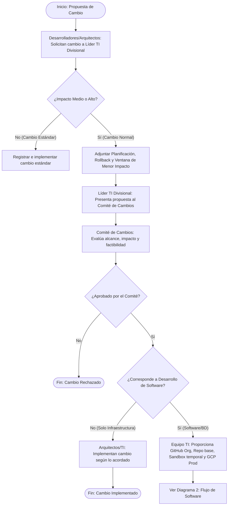
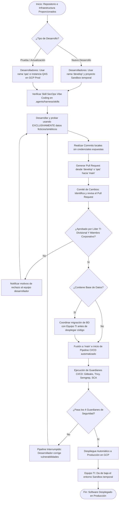

# Diagrama de Flujo: Procedimiento de Cambios en Infraestructura y Software

### 1. Flujo General de Solicitud y Evaluación de Cambios

---

### 2. Flujo de Desarrollo, Pruebas y Despliegue de Software

